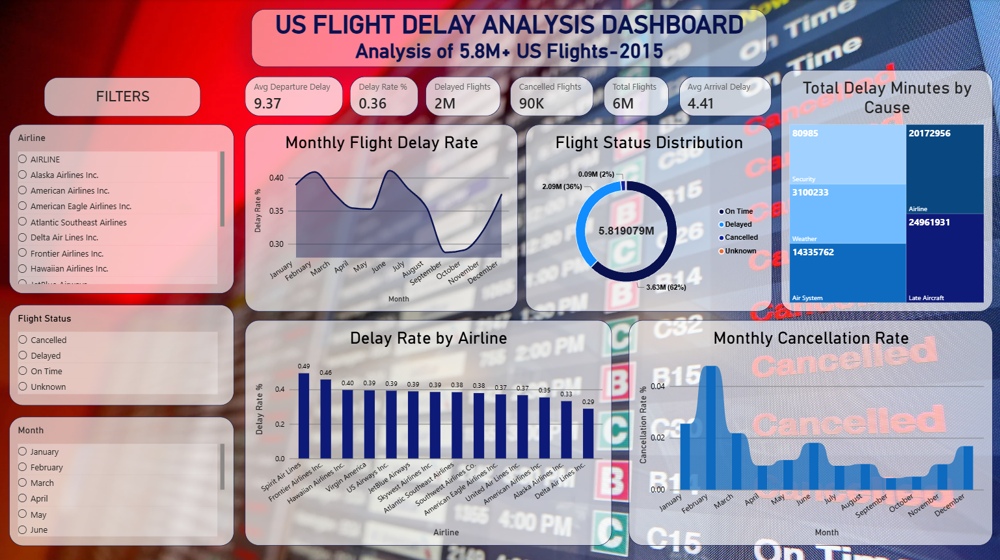
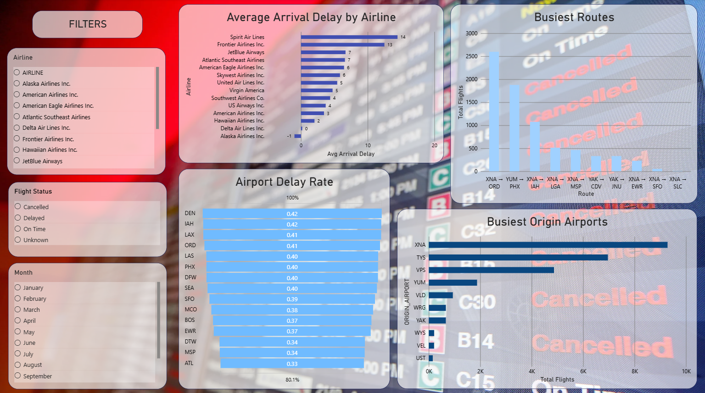

# US Flight Delay & Operational Performance Analytics

## Project Overview

This project analyzes flight delays and operational performance
using a large US flight dataset containing more than 5.8 million
flight records.

The objective is to identify patterns in flight delays,
cancellations, airlines, airports, routes, months, and delay causes.

## Objectives

- Analyze overall flight performance
- Identify airlines with higher delay rates
- Analyze monthly delay and cancellation trends
- Identify major causes of delays
- Analyze busiest airports
- Analyze busiest flight routes
- Build an interactive Power BI dashboard

## Dataset

The dataset contains approximately 5.8 million flight records
and includes information about:

- Flight dates
- Airlines
- Airports
- Departure and arrival times
- Departure and arrival delays
- Flight distance
- Cancellation information
- Delay causes

The original 'flights.csv' file is too large to include directly
in this GitHub repository.

**Dataset Source:** [Kaggle - US Flight Delays Dataset](https://www.kaggle.com/datasets/usdot/flight-delays)

## Tools Used

- Python
- Pandas
- NumPy
- Matplotlib
- Seaborn
- Jupyter Notebook / Kaggle
- Power BI
- GitHub

## Key Findings

- Total flights analyzed: approximately 5.82 million
- Delayed flights: approximately 2.09 million
- Cancelled flights: 89,884
- Average departure delay: 9.37 minutes
- Average arrival delay: 4.41 minutes
- June recorded the highest monthly delay rate at approximately 41.08%
- September recorded the lowest monthly delay rate at approximately 28.70%
- Late aircraft and airline-related issues were major contributors
  to total delay minutes

## Power BI Dashboard

The project includes an interactive Power BI dashboard
for exploring flight delays, airlines, airports, routes,
monthly trends, and delay causes.

## Dashboard Preview

## Project Files

- `Flight_Delay_Analysis.ipynb` — Data analysis
- `US_Flight_Delay_Analysis.pbix` — Power BI dashboard
- `airlines.csv` — Airline reference data
- Dashboard screenshots

## Conclusion

The analysis provides insights into flight delay patterns,
airline performance, airport activity, route performance,
seasonal trends, and major causes of delays.
